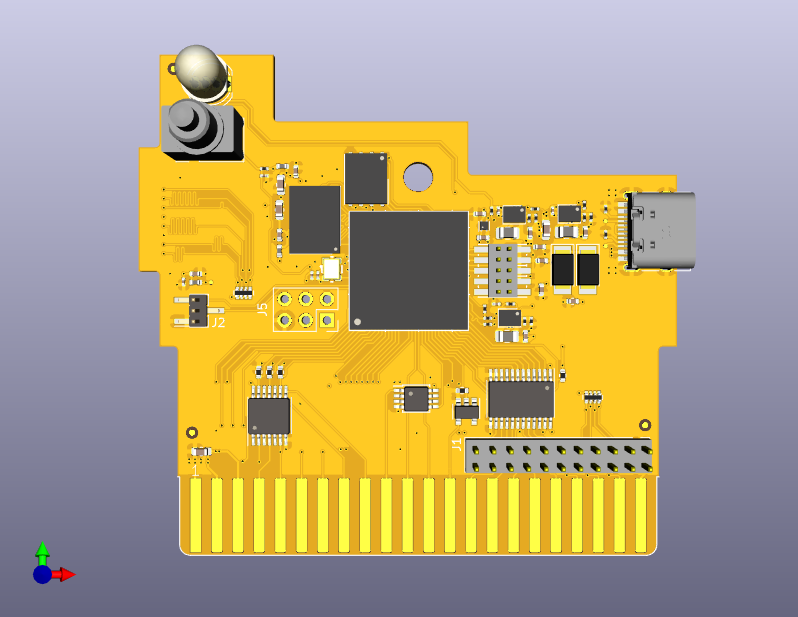

The Orange Cartridge -- an FPGA cartridge for the C64/C128
==========================================================

This is an open source hardware FPGA cartridge for the C64 and C128.
The main features are:
 * ECP5 FPGA with 24k LUTs and 126 KB of block RAM
 * 16 MB of HyperRAM
 * 16 MB of SPI NOR Flash
 * Full speed USB
 * Micro SD-card
 * RGB LED
 * Pushbutton

Usage
-----

For full usage instructions and other detailed information, please refer to
[the wiki][wiki].

The cartridge can be powered from the expansion port, from the USB connector,
or both at once (back-current protection diodes are present at each power
input).

To enter the bootloader, keep the pushbutton pressed down when applying
power.  The LED will start flashing in a rainbow pattern.  A new bitstream
can now be uploaded using DFU.

Example bitstreams
------------------

- [RVCop64](https://github.com/zeldin/RVCop64)
- [super-reu](https://github.com/zeldin/super-reu)

[wiki]: https://github.com/zeldin/OrangeCart/wiki
